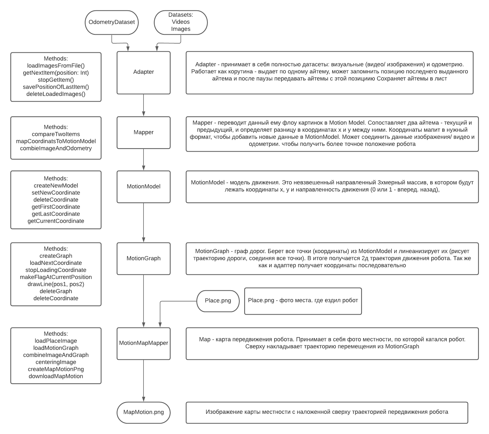

# DuckietwonSlamDiploma

Helpfull urls:
- https://duckietown.mit.edu/media/pdfs/1rpRisFoCYUm0XT78j-nAYidlh-cDtLCdEbIaBCnx9ew.pdf
- http://wiki.ros.org/catkin/Tutorials/create_a_workspace
- http://wiki.ros.org/ROSNodeTutorialPython
- http://wiki.ros.org/ROS/Tutorials/WritingPublisherSubscriber%28python%29
- commands: https://docs.google.com/document/d/1dGnyTAPpp8JxKQbUJcQvN5CqMZmbh6ZszIZRMNf8Ttw/edit?usp=sharing
- https://ethz.ch/content/dam/ethz/special-interest/mavt/dynamic-systems-n-control/idsc-dam/Lectures/amod/Lecture_13/20191104%20-%20ETH%20-%2002%20-%20OdometryCalibration.pdf
